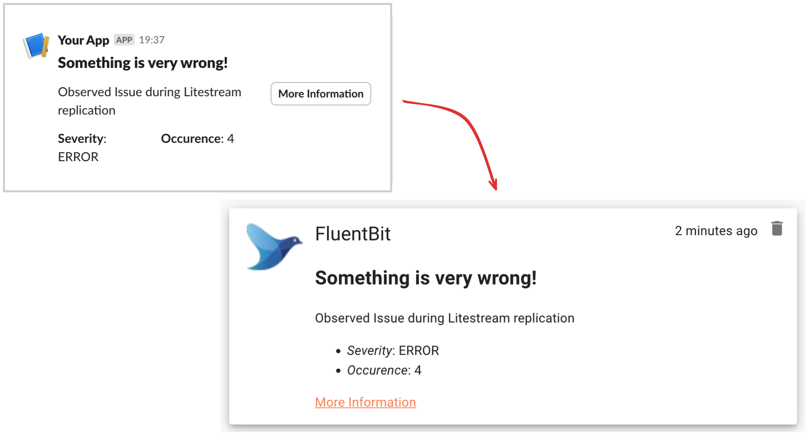

# Gotify Slack Webhook

Allows Gotify to receive [Slack Incoming Webhooks](https://api.slack.com/messaging/webhooks).



**Support**

- Read-only blocks from [Slack Block Kit](https://api.slack.com/reference/block-kit/blocks)
- Buttons pointing to URLs
- Handles any non-supported block by stripping it
- Does **NOT** implement any Slack specific interaction blocks (these are stripped)

**Rational**

Many services already integrate with Slack using Incoming Webhooks. If they don't directly integrate with Gotify, you can configure the Slack Webhook URL to this Plugin and receive the messages meant for Slack in Gotify.

## Setup

1. Build the plugin yourself or download a [binary release](https://github.com/LukasKnuth/gotify-slack-webhook/releases)
2. Make the `.so` file available to Gotify in it's `pluginsdir` (default `/data/plugins`)
3. Launch Gotify and verify the plugin is loaded in the log:

```
Starting Gotify version 2.5.0@2024-06-23-17:12:59
Loading plugin data/plugins/gotify-slack-webhook-linux-arm64.so
Started listening for plain connection on tcp [::]:80
```

4. Navigate to "Plugins" and enable the "Slack Incoming Webhook Support" plugin
5. Click the :gear: icon next to it and note the Webhook URL
6. Under "Apps" create an App for each service and copy the token

```
http://my.gotify.de/plugin/1/custom/unique-to-your-install/webhook/slack/app-token-here
```

7. In the service you want to integrate, configure the full URL as the Slack Incoming Webhook
8. Done

### Example Payload

This is the same payload as used in the above screenshot:

```json
{
  "blocks": [
    {
      "type": "header",
      "text": {
        "type": "plain_text",
        "text": "Something is very wrong!",
        "emoji": true
      }
    },
    {
      "type": "section",
      "text": {
        "type": "plain_text",
        "text": "Observed Issue during Litestream replication"
      },
      "fields": [
        {
          "type": "mrkdwn",
          "text": "*Severity*: ERROR"
        },
        {
          "type": "mrkdwn",
          "text": "*Occurence*: 4"
        }
      ],
      "accessory": {
        "type": "button",
        "text": {
          "type": "plain_text",
          "text": "More Information",
          "emoji": true
        },
        "url": "http://fluent.bit/asdf123"
      }
    }
  ]
}
```

You can build messages interactively in the [Block Kit Builder](https://app.slack.com/block-kit-builder/) and try them out yourself.

## To-Do

- [] Setup Github action workflow to use official `gotify/build` containers to build multi-arch
- [] Add these outputs to a release, allowing the plugin to be downloaded

## References

- [Slack Incoming Webhook documentation](https://api.slack.com/messaging/webhooks)
- [Slack BlockKit](https://api.slack.com/block-kit)
- [Gotify Plugin - Getting started](https://gotify.net/docs/plugin)
- [Gotify Plugin - Reference](https://gotify.net/docs/plugin-write)
- [Gotify Plugin API](https://pkg.go.dev/github.com/gotify/plugin-api)
- [Gotify Plugin Template](https://github.com/gotify/plugin-template)
- [Gin Web Framework](https://gin-gonic.com/docs/examples/param-in-path/) - For the Webhook integration
